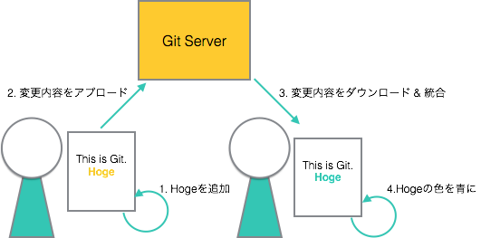

# Cloud Hackathon

* [Cloud Hackathon](#cloud-hackathon)
   * [はじめに](#はじめに)
   * [Githubのアカウント作成](#githubのアカウント作成)
      * [新規登録](#新規登録)
      * [APIトークンの取得](#apiトークンの取得)
   * [そもそもGitとは?](#そもそもgitとは)
      * [チーム開発とGithub](#チーム開発とgithub)
      * [チートシート](#チートシート)
      * [もっとGitを知るには?](#もっとgitを知るには)
   * [サンプルコードを動かしてみよう](#サンプルコードを動かしてみよう)
      * [開発環境にログイン!](#開発環境にログイン)
   * [サンプルコードをセットアップする](#サンプルコードをセットアップする)
   * [コンテナとは?](#コンテナとは)
   * [Dockerとは?](#dockerとは)
   * [コンテナを動かしてみよう](#コンテナを動かしてみよう)
   * [開発サイクルを回してみよう](#開発サイクルを回してみよう)
   * [その他](#その他)
      * [開発マシン情報](#開発マシン情報)
      * [サンプルコード一覧](#サンプルコード一覧)


## はじめに

これから、皆さんにはコンテナを使った開発を手を動かしつつ試してもらいます。  
以下を前提に進めますのでご確認ください。  
何かありましたら、周りのスタッフ又はSlackでご質問ください。

* 指定されたWi-Fiに接続していること
* 自分が割り当てられたチーム名がわかること
* チームのSlackチャネルに参加していること
* SSH可能なターミナルが起動できること


## Githubのアカウント作成

コンテナを動かすその前に...。
今回は、コードの管理に[Github][1]を使用するので先にアカウントを作成していきます。  
すでに取得済みの方は、新規登録を飛ばして[APIトークンの取得](#APIトークンの取得)をしてください。

### 新規登録

1. [Github Sign up][3]にアクセス
2. ユーザー名, メールアドレス, パスワード入力して `Create an account` をクリック
3. プラン選択では`Free`でOK
4. 登録したメールアドレスに登録確認メールが届いていることを確認
5. 登録確認用URLをクリック
6. 完了👏

### APIトークンの取得

1. [Settings - Token][4] にアクセス
2. 右上の`Generate new token`ボタンをクリック
3. 『Token description』には適当な説明を入力
4. scopeは一番上の`repo`(Full control of private repositories)を選択
5. `Generate token`ボタンをクリック
6. 表示されたトークンを保存(あとで使います!)

## そもそもGitとは?

[Git][5]はオープンソースの分散バージョン管理システムです。
v1で保存したあと開発が進みv3に。途中でv1の方がよかったなと思ったらすぐにv1に戻すことができます。
このシステムは、Linuxのソースコードを管理するために[リーナス][6]さんによって開発されました。
先ほどアカウントを作成した[Github][1]は、このGitの仕組みを利用してソースコードを保存/公開できるようにしたWebサービスです。

### チーム開発とGithub



Gitは、1人よりもチーム開発で使用するとありがたみが増します。
それは、チームのメンバーが並行して同じファイルに対して修正を加えても
他のメンバーの修正内容を取り込むための便利な機能があるからです。

> [Git flow][9]というプロジェクト開発に便利なGitの使い方があり、
> 弊社含めこの方法で開発しているところが多いです

### チートシート

今回のハッカソンで使われると思われるコマンドだけピックアップしてみました。
他にやりたいことがあれば、スタッフに聞いてみてください。

* Gitの設定

   ```
   $ git config --global user.name <YOUR NAME>
   $ git config --global user.email <YOUR EMAIL>
   ```

* リモート(Githubとか)からレポジトリをダウンロード

    ```
    $ git clone <REPOSITORY PATH>
    ```

* ファイルの追加(インデックス登録)

   ```
   # 指定したファイルを追加
   $ git add <FILE NAME>
   # すべてのファイルを追加
   $ git add --all
   ```

* 変更内容を確定させる(コミット)

   ```
   $ git commit -m '<MESSAGE>'
   ```

* 変更内容をリモートにアップロード

   ```
   $ git push origin <BRANCH_NAME>
   ```
   
* すべての変更内容をリモードからダウンロード

   ```
   $ git pull
   ```

### もっとGitを知るには?

今回の説明内容はいろいろな情報を省いている(非推奨なこともやっている)ので、
Gitを本格的に使ってみたいなと思った方は、以下のサイトや本を参考にしてください。
特に本の方はチーム開発での流れを追いつつそこで必要なGitを学べるので優秀です。

* [サルでも分かるGit入門][7]
* [Gitによるバージョン管理][8]

## サンプルコードを動かしてみよう

### 開発環境にログイン!

各チームごとのIPアドレスとパスワードについてはスライドをご覧ください。

```
$ ssh hacker@<YOUR TEAM ADDRESS>
```

## サンプルコードをセットアップする

ハッカソン用にいくつかの[サンプルコード](サンプルコード一覧)を用意していますが、
チュートリアルでは

## コンテナとは?

## Dockerとは?

## コンテナを動かしてみよう

## 開発サイクルを回してみよう

## その他

### 開発マシン情報

Name|Value
----|-----
VM|[Cloudn FLAT Compute][2] / 2CPU / 4GB RAM / 15G DISK
OS|Ubuntu 16.04

### サンプルコード一覧

言語別にレポジトリが分かれているのでお好きなものをご利用ください。
ただし、言語によってサンプルコードの内容が違います。

* [golang-apps][0]: Revelを使ったチャットアプリ

[0]: https://github.com/cloud-hackathon/golang-apps
[1]: https://github.com/
[2]: http://www.ntt.com/business/services/cloud/iaas/cloudn.html
[3]: https://github.com/join?source=header-home
[4]: https://github.com/settings/tokens
[5]: https://git-scm.com
[6]: https://ja.wikipedia.org/wiki/%E3%83%AA%E3%83%BC%E3%83%8A%E3%82%B9%E3%83%BB%E3%83%88%E3%83%BC%E3%83%90%E3%83%AB%E3%82%BA
[7]: http://www.backlog.jp/git-guide/
[8]: https://www.amazon.co.jp/Git%E3%81%AB%E3%82%88%E3%82%8B%E3%83%90%E3%83%BC%E3%82%B8%E3%83%A7%E3%83%B3%E7%AE%A1%E7%90%86-%E5%B2%A9%E6%9D%BE%E4%BF%A1%E6%B4%8B-%E4%B8%8A%E5%B7%9D%E7%B4%94%E4%B8%80-%E3%81%BE%E3%81%88%E3%81%A0%E3%81%93%E3%81%86%E3%81%B8%E3%81%84-%E5%B0%8F%E5%B7%9D%E4%BC%B8%E4%B8%80%E9%83%8E-ebook/dp/B01IGW562K/ref=sr_1_15?s=books&ie=UTF8&qid=1484651787&sr=1-15&keywords=git
[9]: http://nvie.com/posts/a-successful-git-branching-model/
