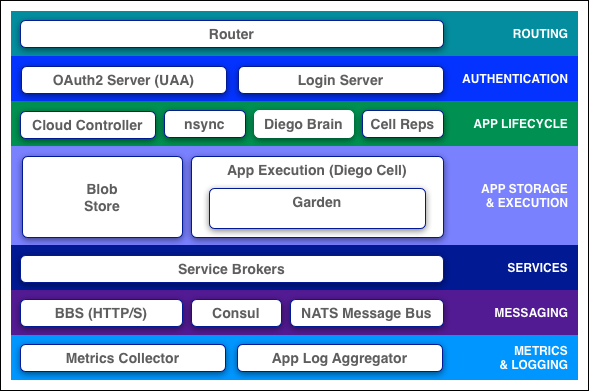

## Cloud Foundryとは?

[Cloud Foundry](https://www.cloudfoundry.org/) は主にRuby、Go言語によって開発されているオープンソースのPaaS(Open PaaS)です。  
当初VMWare社が開発を行っていましたが、2014年にCloud Foundry Foundationに開発のガバナンスを移管されました。

### Cloud Foundry上でアプリを動作させるまでの流れ

1. ユーザがアプリをpush
2. Buildpackが実行される
    1. Detect(Buildpackの実行条件と合致するかチェック)
    2. Compile(実行環境を構築)
    3. Release(実行に必要な環境変数などの情報を出力)
3. Cloud Foundryの実行ノードでアプリを起動

参考: [Cloud Foundryで学ぶ、PaaSのしくみ講座](https://www.slideshare.net/jacopen/paas-for-beginners)

### コンポーネント

主に公式の [Documentation](http://docs.cloudfoundry.org/concepts/architecture/index.html) を元に記述しています。  

- Routing
    - Router
        - URLによってアクセスを振り分けるコンポーネント - 実体はUbuntu上にて動作する
- Authentication
    - OAuth2 Server (UAA) and Login Server
        - 認証の管理
- App Lifecycle
    - Cloud Controller and Diego Brain
        - アプリのライフサイクルを管理する
        - pushされたものを受け取る、Dropletを実行環境に受け渡す、など
    - nsync, BBS, and Cell Reps
        - アプリが継続して実行されるようにステータスの管理を実行する
- App Storage & Execution
    - Blobstore
        - 様々なバイナリファイルのレポジトリとして機能する
    - Diego Cell
        - アプリをコンテナとして実行する - Services
    - Service Brokers
        - 外部のサービスと連携したりできる(e.g. MySQL)
- Messaging
    - Consul and BBS
        - コンポーネント間の通信に使われる
- Metrics & Logging
    - ログと監視メトリクスの管理

### インターフェイス

Cloud Foundryでは `cf` CLIを利用して操作を行います。

### サポートされるランタイム

* Java
* Ruby
* Node.js
* Scala
* Go
* Python
* PHP

など
