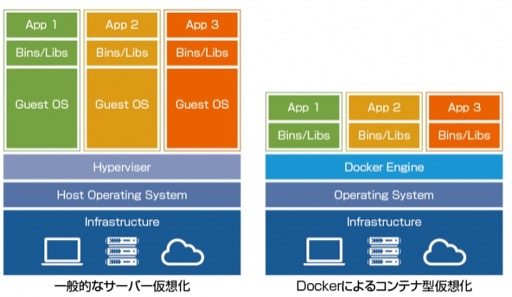

## コンテナとは?

コンテナとは、OS上に隔離された空間(サンドボックス)を作成し、その中で別の環境を実行できる技術です。  
コンテナにはCPUやメモリなどのリソースが割り当てられ、プロセスの実行環境が分離されます。  
(namespaceやcgroupsというLinuxカーネルの技術を使っています。)

[VMWare Player](http://www.vmware.com/products/player/playerpro-evaluation.html) や [Oracle VirtualBox](https://www.virtualbox.org) などのハイパーバイザ型の仮想化と比較して高速・軽量という特徴があります。  
ハイパーバイザではハードウェアをシミュレートして仮想マシンを動作させているため、  
オーバーヘッドが大きくなりがちです。

コンテナではカーネル(OSの基本的な部分)を共有し実行環境を分離しているだけなので、オーバーヘッドが小さいです。  
そのため、起動・停止が高速だったり、1台のサーバ上で大量のコンテナを動かしたりできます。

* [コンテナ技術の基礎知識](https://thinkit.co.jp/story/2015/08/11/6285)
* [注目を浴びる「Dockerコンテナ」、従来の仮想化と何が違うのか？](http://cn.teldevice.co.jp/column/detail/id/102)
