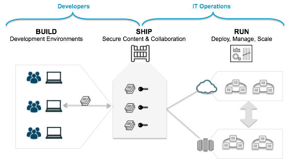

## Dockerとは?

### Dockerの概要

🐳 [Docker](https://www.docker.com)とは、コンテナを動かすためのオープンソースソフトウェアです。  
コンテナの中身(Dockerイメージ)を作る仕組みや、コンテナの実行環境を提供しています。  

Dockerイメージとは、コンテナとして動かすOSとアプリケーションをまとめたものです。  
軽量でどこでも同じように動くという特徴があるため、アプリケーションを配布するのに向いています。  
[Docker Hub](https://hub.docker.com)というWebサイトがあり、様々なDockerイメージが公開されています。  



* [巷で話題のDockerとは?](https://thinkit.co.jp/story/2015/08/05/6284)
* [Containers As A Service (CaaS) As Your New Platform For Application Development And Operations](https://blog.docker.com/2016/02/containers-as-a-service-caas/)

### Dockerイメージを作ってみよう

Dockerfileを使えば、Dockerイメージを簡単に作ることができます。  
ベースとなるイメージを指定し、イメージを作るために必要なコマンドを記述します。  
例えば、[Ubuntu](https://www.ubuntu.com)上で `hello-world.rb` というスクリプトを動かすコンテナを考えます。  
Rubyをインストールして、スクリプトをコンテナに追加するだけで完成です。  

* hello-world.rb
```ruby
puts "Hello World!"
```

* Dockerfile
```dockerfile
FROM ubuntu:16.04

RUN apt-get update && \
    apt-get -y upgrade && \
    apt-get -y install ruby

ADD hello-world.rb .

CMD ruby hello-world.rb
```

```
$ docker build -t hello-world .
$ docker run hello-world
```

* [Dockerイメージの理解とコンテナのライフサイクル](http://www.slideshare.net/zembutsu/docker-images-containers-and-lifecycle)

### コンテナを組み合わせて使うには?

Dockerでは、メンテナンス性を高めるために、コンテナで実行する機能を小さくしようと言われています。
例えばWebアプリケーションの場合、アプリ用のコンテナと、データベース用のコンテナは分けることが多いです。
このように複数のコンテナで構成されるサービスを動かしたいときに便利なのが[Docker Compose](https://docs.docker.com/compose/)です。
docker-composeを使うことで、複数のコンテナを一度に起動できるだけでなく、依存関係の解決もしてくれます。
(先にデータベース用のコンテナを起動してから、アプリ用のコンテナを起動するなど。)

起動するコンテナとその設定は `docker-compose.yml` という[YAML](https://ja.wikipedia.org/wiki/YAML)形式のファイルに記述します。
例えば `web` と `database` というコンテナを起動する場合は、以下のような内容になります。
`web` では8080番ポートが接続され、カレントディレクトリが `/code` にマウントされます。
また、 `web` が依存する `database` が先に起動されます。

```yaml
version: '2'
services:
  web:
    build: .
    ports:
      - "8080:8080"
    volumes:
      - "$PWD:/code"
    depends_on:
      - database
  database:
    image: mysql
```

### コンテナを動かしてみよう

では、サンプルコードを動かしてみましょう。  
まずは先ほどダウンロードした`django-plane`のディレクトリに移動します。  

```
$ cd python-apps/django-plane
$ ls
Dockerfile  README.md  docker-compose.yaml  img  src
$ cat docker-compose.yaml
version: '2'
services:
  web:
    build: .
    ports:
      - "8080:8080"
    volumes:
      - "$PWD/src:/code"
```

この `docker-compose.yaml` を 実行するには、`docker-compose up`コマンドを使います。  

```
$ docker-compose up

# カレントディレクトリにあるDockerfileのビルド
Building web
Step 1 : FROM python:2.7.13-alpine
 ---> c80455665c57
Step 2 : ENV PYTHONUNBUFFERED 1

~~ 省略 ~~~

Step 8 : ENTRYPOINT /code/docker-entrypoint.sh
 ---> Using cache
 ---> 97aa91549ddf
Successfully built 97aa91549ddf

# djangoの起動(以下Log)
Starting djangoplane_web_1
Attaching to djangoplane_web_1
web_1  | + ./projectname/manage.py migrate
web_1  | Operations to perform:
web_1  |   Synchronize unmigrated apps: staticfiles, home, django_extensions, messages, compressor
```

これだけでDjangoのアプリケーションが立ち上がりました。  
実際にブラウザから`http://<VM IP ADDRESS>:8080`をみてみましょう。  

このような画面が見えましたか?  
何も表示されないなど、何か問題がありましたらお近くのスタッフまでお声がけください。  


