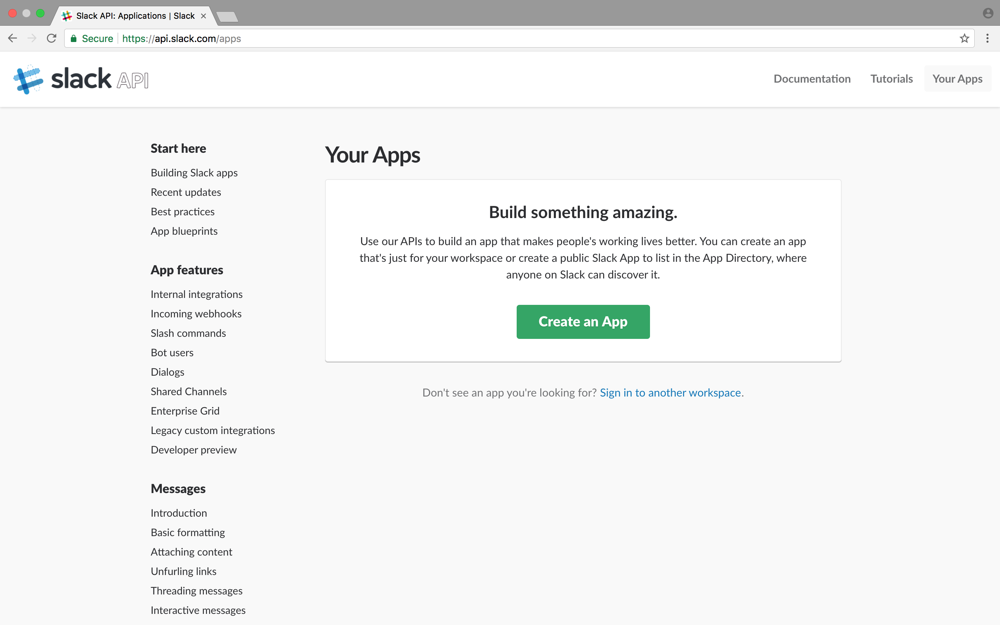
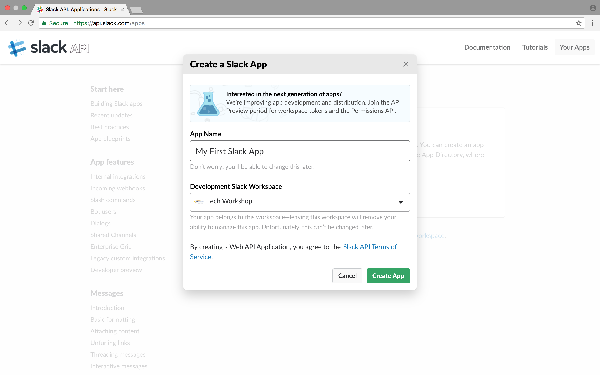
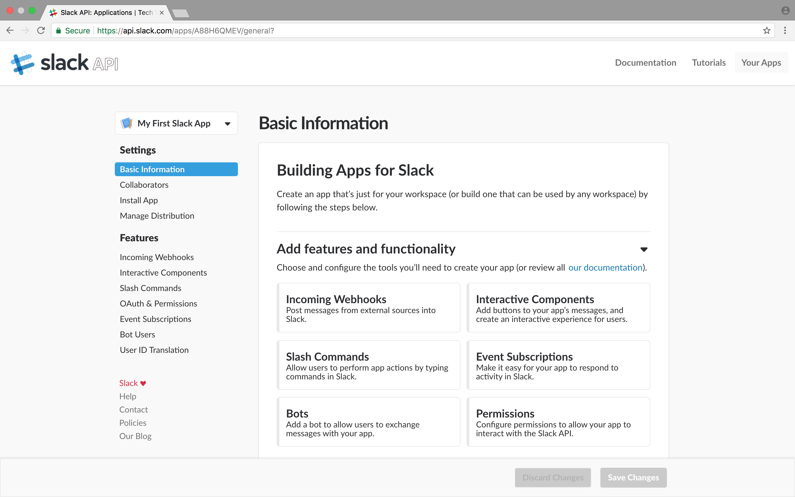
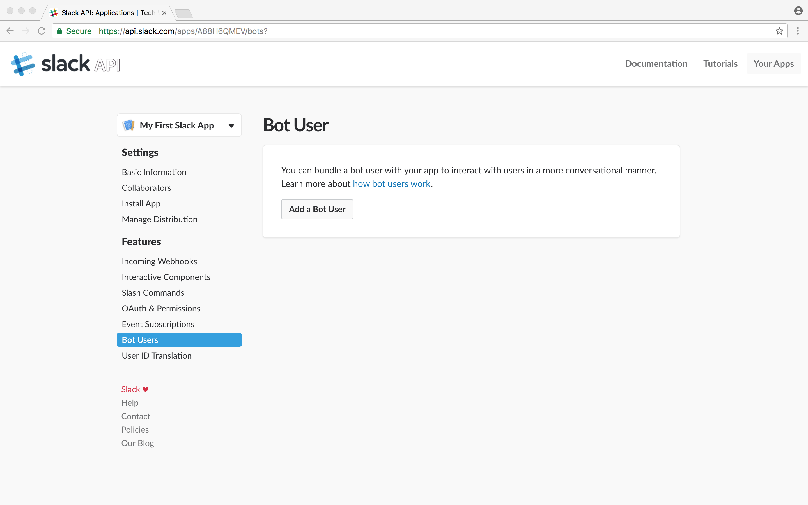
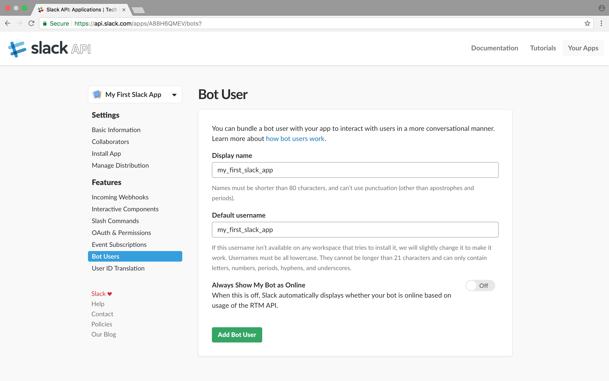
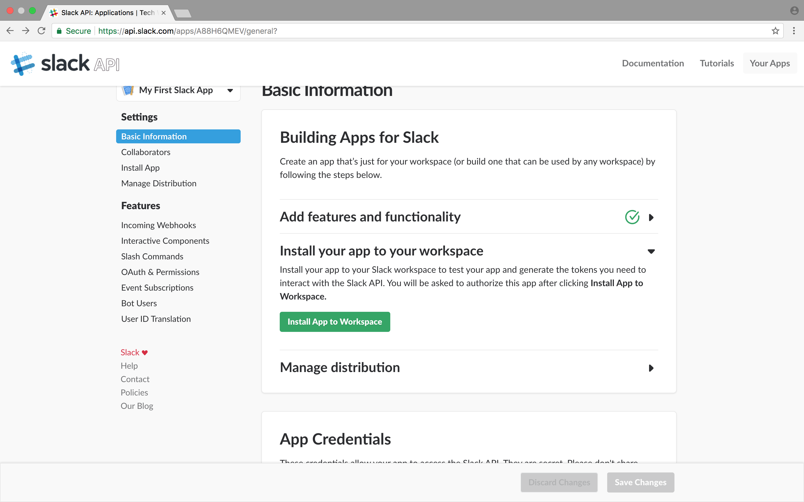
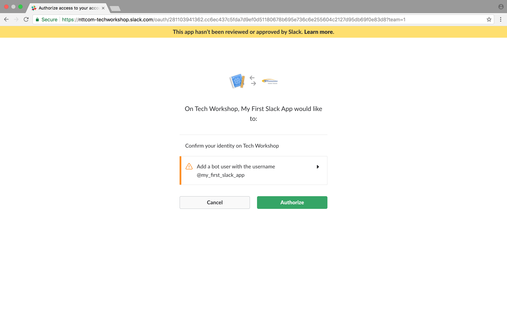
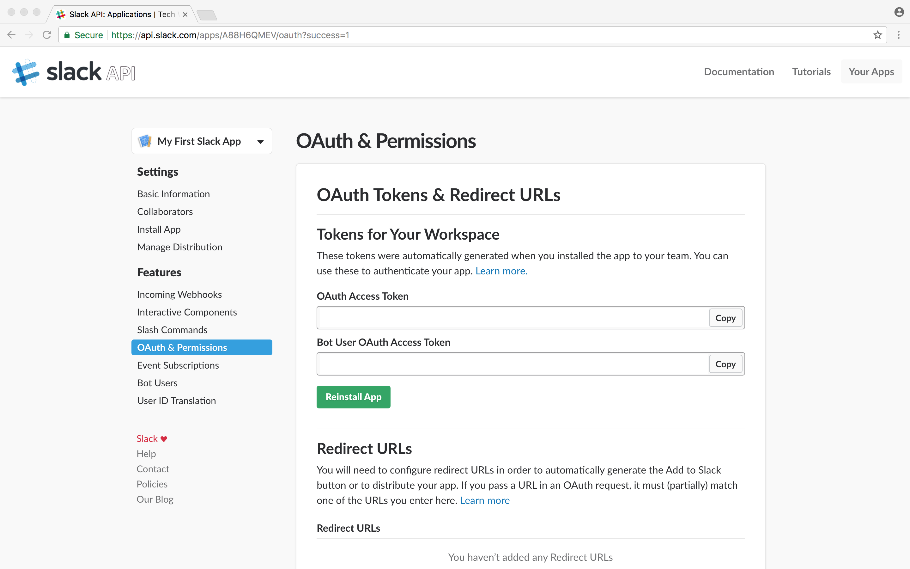
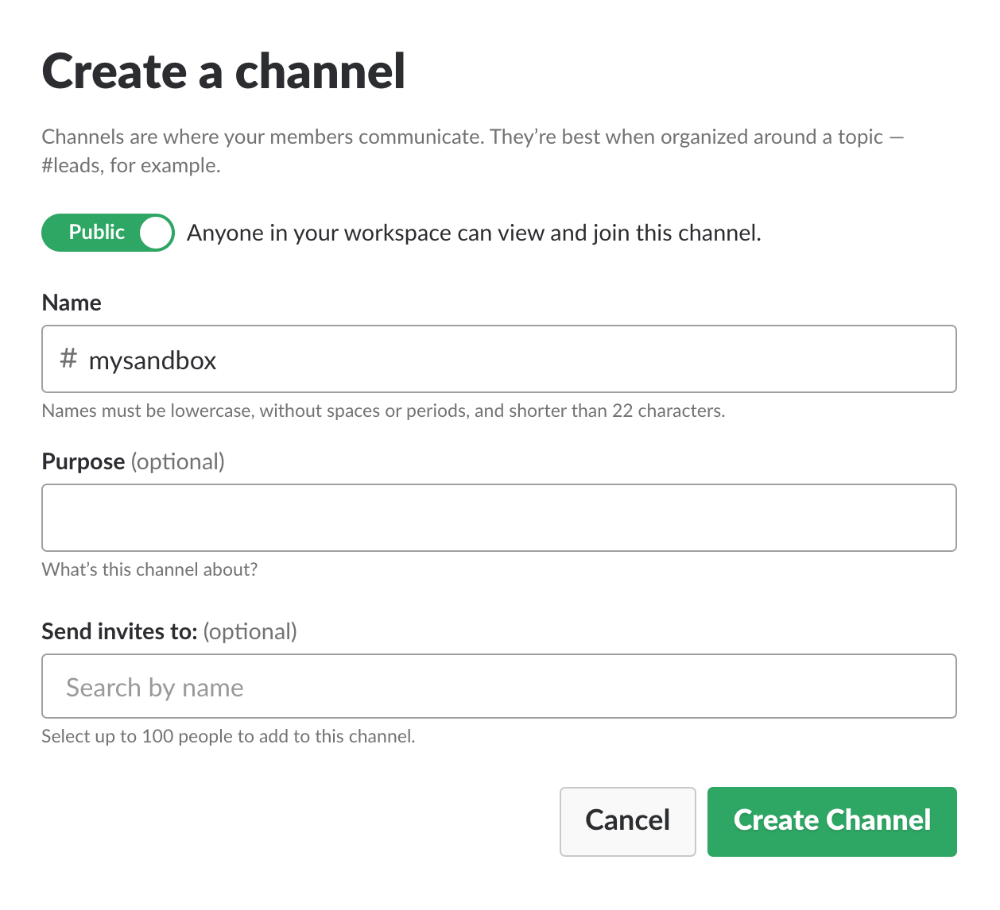
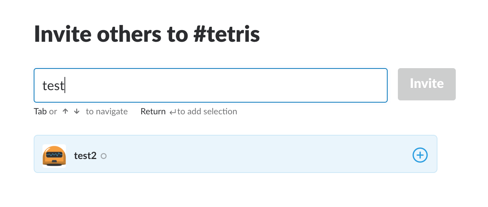

## Slack Appを追加してみよう

### Slack Appの実現方法

Slack Appの開発を始める前に[開発者向けドキュメント](https://api.slack.com/slack-apps)を見てみましょう。  
App capabilitiesセクションにある通り、開発者は様々な方法でSlack Appを実現することができます。

1. `Incoming Webhooks` : Webhook経由で指定のチャンネルにメッセージを投稿する
2. `Slash Commands` : ユーザからのコマンドに合わせたタスクを実行する
3. `Bot User` : ユーザと対話しながらタスクを実行する
4. `Internal Integrations` : 他者に公開しないドメスティックなSlack Appの総称
5. `Message Buttons` : メッセージにボタンを追加する
6. `Real Time Messaging and Events` : 条件を満たしたときにメッセージを投稿する
7. `Permission Scope` : Slack Appの権限を管理する
8. `OAuth` : Slack Appを認証する
9. `App Directory` : Slack Appを他者に公開する

開発者向けドキュメント右上のTutorialsにまとまっているハウツーをこなしていくと  
Slack Appの開発について段々と理解が深まります。
しかし、今回は短い時間の中で成果を出さなければならないので、  
Slack Appの中でも比較的メジャーなBot Userの開発フローをまとめました。

### Bot Userの登録方法

開発者向けドキュメント右上のYour Appsに遷移して新しいBot Userを開発していきましょう。

1. [Your Apps](https://api.slack.com/apps)にアクセスする
  

2. Create New Appボタンを押し、Slack Appの名前と紐付けるWorkspaceを入力し、Create Appボタンを押す
  

3. 作成したAppのBasic Informationページにリダイレクトされる
  

4. Add features and functionalityのBotsパネルを押し、Add a Bot Userボタンを押す
  

5. Display nameとDefault usernameを入力し、Add Bot Userボタンを押す
  

6. 左メニューからBasic Informationに戻り、Install your app to your workspaceのInstall App to Workspaceを押す
  

7. 追加されるBotのusernameを確認してAuthorizeボタンを押す
  

8. 取得したTokenを控えつつ好きな言語・フレームワークでBotを実装する
    
    * Javascript/Ruby/Pythonなどさまざまな言語で実装された [Slack Appサンプル集](links.md) を用意しています
    * これらをベースにするもよし、一から開発するもよしです
    * ここでは [Hubotとは?](hubot.md) に従って簡単なBotを作成したとします

9. Bot UserをInviteするためにPublic Channelを作成する
    
    * Slackアプリを起動しChannelsの右にある+ボタンを押して新しいPublic Channelを追加しましょう。

10. 作成したPublic ChannelにBot UserをInviteする
    
    * 作成したPublic Channelを開きinfoマークを押します
    * 右メニューを表示させMembersのInvite more peopleから作成したBot Userを追加しましょう

11. localhostでHubotを実行する
    * Hubotを実行してからSlackで動作確認してみましょう
    * 問題なければSlack AppをPaaSにデプロイしてみんなに自慢しましょう!
