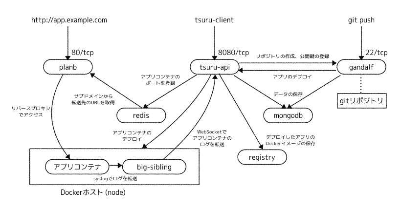

## tsuruとは?

[tsuruの紹介とtsuru-nowを使った簡単な導入方法](https://qiita.com/hiconyan/items/eefb8bcb5cd25191c5e8)

[tsuru](https://github.com/tsuru/tsuru) は [Docker](https://www.docker.com) をベースにしたオープンソースのPaaS(Open PaaS)です。  
ブラジル最大の放送局である [globo.com](http://www.globo.com/) が中心となって、Go言語で開発されています。

### tsuruのアーキテクチャ

### tsuruの用語

[Concepts](https://docs.tsuru.io/stable/understanding/concepts.html) より。

- Cluster
    - Nodeの集り、この中でUnitが分散される。
        - [Segregate Scheduler](https://docs.tsuru.io/stable/managing/segregate-scheduler.html)
- Node
    - Unitが動作するDockerホスト。
    - EC2などのIaaS上でオートスケール可能。
        - [Node Auto Scaling](https://docs.tsuru.io/stable/advanced_topics/node_scaling.html)
- Application
    - Unit上で動作するアプリケーション。
    - パッケージやライブラリの依存情報と `Procfile` を含む。
- Unit
    - アプリケーションが動作するDockerコンテナ。
    - デプロイ時にDockerイメージがビルドされる。
- Platform
    - 各言語のランタイムを含んだDockerイメージ。
    - PlatformをベースにUnitのDockerイメージがビルドされる。
    - Node.jsやRubyだけでなく、Buildpackにも対応している。
        - [tsuru/platforms](https://github.com/tsuru/platforms)
- Service
    - Application向けのミドルウェアを提供する機能。

### tsuruのコンポーネント

[Architecture](https://docs.tsuru.io/stable/understanding/architecture.html) より、全てGo言語で開発さています。

- [tsuru/tsuru](https://github.com/tsuru/tsuru)
    - `tsurud` と呼ばれるRESTful APIサーバ。
    - データベースに[MongoDB](https://www.mongodb.com)を使用している。
    - [API reference](https://docs.tsuru.io/stable/reference/api.html)
- [tsuru/gandalf](https://github.com/tsuru/gandalf)
    - Gitリポジトリを管理するRESTful APIサーバ。
    - ユーザーの作成、公開鍵の登録、リポジトリの作成など。
- [tsuru/planb](https://github.com/tsuru/planb)
    - [Hipache](https://github.com/hipache/hipache)インスパイアのHTTPプロキシサーバ。
    - バックエンドに[Redis](https://redis.io)を使用している。
    - アプリケーションへのアクセスをUnitに転送している。
